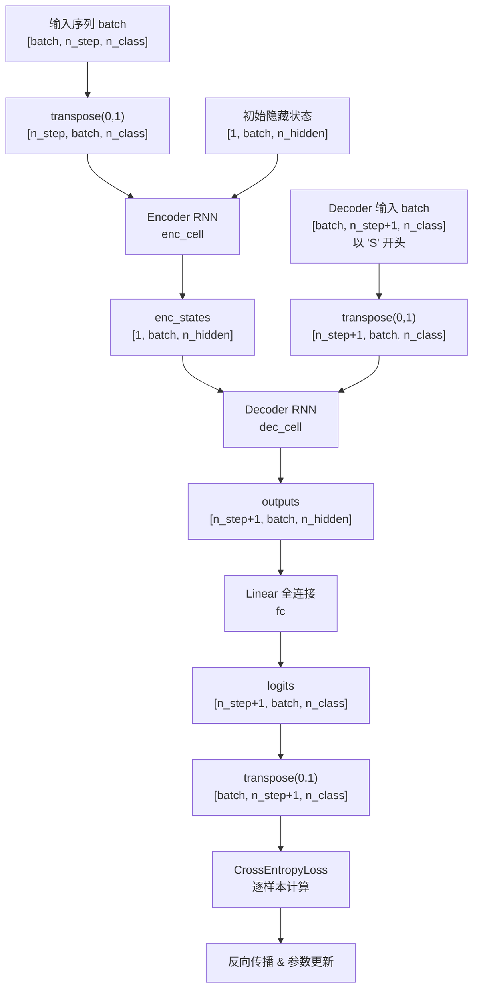

# Seq2Seq 模型技术文档

## 1. 模型整体架构

本实现基于经典的 **Encoder-Decoder** 架构，使用单层单向 RNN 作为核心组件，完成序列到序列的映射任务（如机器翻译）。

### 1.1 核心组件

| 模块 | PyTorch 实现 | 功能描述 |
|------|-------------|----------|
| Encoder RNN | `nn.RNN(input_size=n_class, hidden_size=n_hidden, dropout=0.5)` | 将输入序列编码为固定维度的隐藏状态向量 |
| Decoder RNN | `nn.RNN(input_size=n_class, hidden_size=n_hidden, dropout=0.5)` | 以 Encoder 最终隐藏状态为初始状态，自回归生成输出序列 |
| 全分类层 | `nn.Linear(n_hidden, n_class)` | 将 Decoder 每个时间步的隐藏状态映射到词表空间 |

### 1.2 数据流概要

```
输入序列 → [One-Hot] → Encoder RNN → 最终隐藏状态 h_n
                                              ↓
输出序列('S'开头) → [One-Hot] → Decoder RNN → 全连接层 → 词表概率分布
```

---

## 2. 张量维度变化追踪表

### 2.1 数据预处理阶段

| 步骤 | 变量 | 维度 | 说明 |
|------|------|------|------|
| 原始输入 | `seq[0]` | 字符串，长度 ≤ n_step | 如 `'man'` |
| Padding 后 | `seq[0] + 'P'*(n_step-len)` | 字符串，长度 = n_step | 如 `'manPP'` |
| 索引化 | `input` | `[n_step]` | 字符→数字索引 |
| One-Hot | `np.eye(n_class)[input]` | `[n_step, n_class]` | 独热编码 |
| Batch 堆叠 | `input_batch` | `[batch_size, n_step, n_class]` | 转为 FloatTensor |
| Decoder 输入 | `output_batch` | `[batch_size, n_step+1, n_class]` | 以 'S' 开头，多一个时间步 |
| Target | `target_batch` | `[batch_size, n_step+1]` | 原始索引，非 One-Hot |

### 2.2 前向传播阶段

| 步骤 | 变量 | 维度 | 说明 |
|------|------|------|------|
| 编码器输入转置 | `enc_input.transpose(0,1)` | `[n_step, batch_size, n_class]` | PyTorch RNN 要求 `(seq_len, batch, input_size)` |
| 初始隐藏状态 | `hidden` / `enc_hidden` | `[1, batch_size, n_hidden]` | `num_layers * num_directions = 1` |
| 编码器输出状态 | `enc_states` | `[1, batch_size, n_hidden]` | Encoder 最终隐藏状态，传递给 Decoder |
| 解码器输入转置 | `dec_input.transpose(0,1)` | `[n_step+1, batch_size, n_class]` | 包含 'S' 起始符 |
| 解码器输出 | `outputs` | `[n_step+1, batch_size, n_hidden]` | 每个时间步的隐藏状态 |
| 全连接输出 | `model` / `output` | `[n_step+1, batch_size, n_class]` | 词表上的 logits |
| 转置回 Batch 优先 | `output.transpose(0,1)` | `[batch_size, n_step+1, n_class]` | 便于逐样本计算损失 |
| 单样本输出 | `output[i]` | `[n_step+1, n_class]` | 与 `target_batch[i]` 配对计算 CrossEntropyLoss |
| 预测索引 | `predict` | `[n_step+1, 1, 1]` | `max(2, keepdim=True)[1]` |

### 2.3 测试推理阶段

| 步骤 | 变量 | 维度 | 说明 |
|------|------|------|------|
| 测试输入 | `input_batch` | `[1, n_step, n_class]` | `unsqueeze(0)` 增加 batch 维度 |
| 测试隐藏状态 | `hidden` | `[1, 1, n_hidden]` | batch_size=1 |
| 模型输出 | `output` | `[n_step+1, 1, n_class]` | |
| 预测结果 | `decoded` | `[n_step+1]` 个字符 | 通过 `char_arr` 索引解码 |

---

## 3. Mermaid 数据流图



### 3.1 模块交互说明

1. **Encoder 阶段**：输入序列经过 One-Hot 编码后送入 Encoder RNN，仅使用最后一个时间步的隐藏状态 `enc_states` 作为整个输入序列的语义表示。
2. **上下文传递**：`enc_states` 直接作为 Decoder RNN 的初始隐藏状态，实现信息从 Encoder 到 Decoder 的传递。
3. **Teacher Forcing**：训练时 Decoder 的输入是完整的真实目标序列（以 'S' 开头），而非上一时间步的预测结果，这加速了训练收敛。
4. **自回归推理**：测试时 Decoder 输入为 `'S' + 'P' * n_step`，模型一次性输出所有时间步的预测，通过 `max` 操作提取预测字符。

---

## 4. 关键设计选择与超参数

| 超参数/设计 | 取值 | 说明 |
|------------|------|------|
| `n_step` | 5 | 输入序列最大长度，不足则用 'P' 填充 |
| `n_hidden` | 128 | RNN 隐藏层维度 |
| `n_class` | 29 | 词表大小：26 字母 + 'S' + 'E' + 'P' |
| `batch_size` | 6 | 训练样本对数量 |
| `dropout` | 0.5 | RNN 内部的 Dropout 率 |
| `lr` | 0.001 | Adam 优化器学习率 |
| `epochs` | 5000 | 训练轮数 |
| 损失函数 | CrossEntropyLoss | 逐样本计算后累加 |
| RNN 层数 | 1 | 单层 RNN |
| RNN 方向 | 单向 | 非双向 |

### 4.1 设计选择分析

1. **固定长度填充**：所有输入序列统一填充至 `n_step` 长度，简化批处理但限制了变长序列的灵活性。
2. **Teacher Forcing 策略**：训练时 Decoder 使用真实标签作为输入，避免误差累积，但可能导致训练-推理分布不一致。
3. **无 Attention 机制**：本实现为 vanilla Seq2Seq，所有输入信息压缩至单一固定维度向量，长序列信息易丢失。
4. **非自回归推理**：测试时一次性输入完整 `'S' + 'P'*n_step` 序列，而非逐时间步自回归生成，利用 RNN 的自回归特性在单次前向传播中完成预测。
5. **损失计算方式**：遍历 batch 中每个样本独立计算 CrossEntropyLoss 后累加，而非直接对整个 batch 张量计算。
