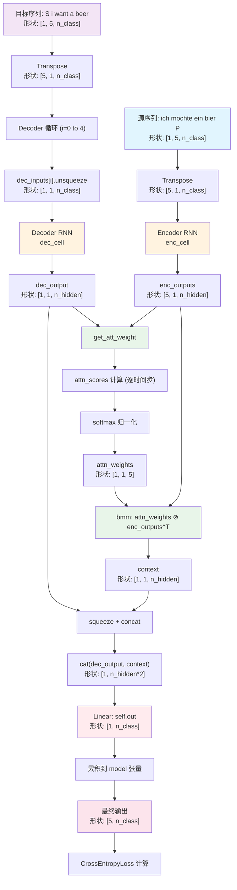

# Seq2Seq with Attention 模型技术文档

## 1. 模型整体架构

本实现基于 **Bahdanau Attention**（加性注意力）机制的 Sequence-to-Sequence（Seq2Seq）模型，用于机器翻译任务。模型由以下核心组件构成：

| 组件 | 说明 |
|------|------|
| **Encoder** | 单层单向 RNN，将源语言序列编码为隐藏状态序列 |
| **Decoder** | 单层单向 RNN，自回归生成目标语言序列 |
| **Attention 机制** | 在每个解码步骤动态计算编码器各时间步的注意力权重，生成上下文向量 |
| **Output Layer** | 线性层，将解码器输出与上下文向量拼接后映射到词汇表空间 |

### 1.1 核心计算流程

1. **编码阶段**：Encoder 接收源序列的 one-hot 编码，逐时间步生成隐藏状态序列 `enc_outputs`
2. **注意力计算**：对每个解码时间步，计算当前解码隐藏状态与所有编码隐藏状态的注意力分数
3. **上下文向量**：使用注意力权重对 `enc_outputs` 加权求和得到上下文向量
4. **解码阶段**：将解码器输出与上下文向量拼接，通过线性层生成目标词汇概率分布

---

## 2. 张量维度追踪表

### 2.1 数据预处理阶段

| 变量 | 原始形状 | 变换后形状 | 说明 |
|------|----------|------------|------|
| `sentences[0]` (源句) | `"ich mochte ein bier P"` | - | 5 个 token |
| `sentences[1]` (解码输入) | `"S i want a beer"` | - | 5 个 token |
| `sentences[2]` (目标输出) | `"i want a beer E"` | - | 5 个 token |
| `input_batch` | - | `[1, 5, n_class]` | one-hot 编码，batch_size=1 |
| `output_batch` | - | `[1, 5, n_class]` | one-hot 编码，batch_size=1 |
| `target_batch` | - | `[1, 5]` | 目标 token 索引 |

### 2.2 Encoder 阶段

| 变量 | 形状 | 维度说明 |
|------|------|----------|
| `enc_inputs` (输入) | `[5, 1, n_class]` | transpose 后: `[n_step, batch_size, n_class]` |
| `hidden` (初始) | `[1, 1, n_hidden]` | `[num_layers, batch_size, n_hidden]` |
| `enc_outputs` | `[5, 1, n_hidden]` | 每个时间步的隐藏状态，即矩阵 F |
| `enc_hidden` | `[1, 1, n_hidden]` | 最终隐藏状态 |

### 2.3 Decoder 单步计算（以第 i 步为例）

| 步骤 | 变量 | 形状 | 操作 |
|------|------|------|------|
| 1 | `dec_inputs[i]` | `[1, n_class]` | 当前时间步输入 |
| 2 | `dec_inputs[i].unsqueeze(0)` | `[1, 1, n_class]` | 添加时间步维度 |
| 3 | `dec_output` | `[1, 1, n_hidden]` | Decoder RNN 输出 |
| 4 | `hidden` | `[1, 1, n_hidden]` | 更新后的隐藏状态 |
| 5 | `attn_weights` | `[1, 1, n_step]` | 注意力权重分布 |
| 6 | `enc_outputs.transpose(0,1)` | `[1, n_step, n_hidden]` | 转置用于 batch matrix multiply |
| 7 | `context` | `[1, 1, n_hidden]` | 上下文向量 = attn_weights ⊗ enc_outputs |
| 8 | `dec_output.squeeze(0)` | `[1, n_hidden]` | 移除时间步维度 |
| 9 | `context.squeeze(1)` | `[1, n_hidden]` | 移除 batch 维度 |
| 10 | `torch.cat(...)` | `[1, n_hidden * 2]` | 拼接解码输出与上下文向量 |
| 11 | `self.out(...)` | `[1, n_class]` | 映射到词汇表空间 |

### 2.4 注意力分数计算 (`get_att_score`)

| 变量 | 形状 | 说明 |
|------|------|------|
| `dec_output` | `[1, n_hidden]` | 当前解码隐藏状态 |
| `enc_output` | `[1, n_hidden]` | 某个编码时间步的隐藏状态 |
| `self.attn(enc_output)` | `[1, n_hidden]` | 对编码状态进行线性变换 |
| `score` (内积结果) | `标量` | dec_output 与 transformed enc_output 的点积 |

### 2.5 最终输出

| 变量 | 形状 | 说明 |
|------|------|------|
| `model` (累积) | `[n_step, 1, n_class]` | 所有时间步的预测结果 |
| 最终输出 | `[n_step, n_class]` | transpose + squeeze 后: `[5, n_class]` |

---

## 3. 数据流图 (Mermaid)



---

## 4. 关键设计选择与超参数

### 4.1 超参数配置

| 超参数 | 值 | 说明 |
|--------|-----|------|
| `n_step` | 5 | 序列长度（编码/解码时间步数） |
| `n_hidden` | 128 | RNN 隐藏层维度 |
| `dropout` | 0.5 | RNN dropout 比率（本实现中效果有限，因仅单层） |
| `learning_rate` | 0.001 | Adam 优化器学习率 |
| `epochs` | 2000 | 训练轮数 |
| `batch_size` | 1 | 固定为 1（单样本训练） |

### 4.2 关键设计选择

#### 4.2.1 注意力机制类型

本实现采用 **加性注意力（Additive Attention）** 的简化形式：
- `get_att_score` 中对 `enc_output` 进行线性变换 `self.attn(enc_output)`，然后与 `dec_output` 做点积
- 与原始 Bahdanau Attention 的区别：未使用 `tanh` 和非线性投影，而是简化为单层线性变换 + 内积

#### 4.2.2 循环式注意力计算

- `get_att_weight` 使用 for 循环逐时间步计算注意力分数，而非矩阵化并行计算
- 优点：逻辑清晰，易于理解
- 缺点：效率较低，实际生产环境应使用矩阵运算

#### 4.2.3 Teacher Forcing 策略

- 训练时直接传入真实目标序列 `output_batch` 作为解码器输入
- 测试时传入 `'SPPPP'`（起始符 + 填充符）进行自回归生成

#### 4.2.4 特殊符号约定

| 符号 | 含义 |
|------|------|
| `S` | Decoder 输入起始标记 |
| `E` | Decoder 输出结束标记 |
| `P` | Padding 填充标记 |

#### 4.2.5 损失函数

使用 `CrossEntropyLoss`，自动处理 softmax 和负对数似然计算，适用于多分类任务。

---

## 5. 训练与推理流程

### 5.1 训练流程
```
输入: (源序列, 解码输入, 目标输出)
  ↓
Encoder 编码源序列 → enc_outputs
  ↓
Decoder 逐时间步:
  - RNN 步进得到 dec_output
  - 计算注意力权重 attn_weights
  - 生成上下文向量 context
  - 拼接并预测 → logits
  ↓
计算 CrossEntropyLoss
  ↓
反向传播 + Adam 优化
```

### 5.2 推理流程
```
输入: 源序列 + 'SPPPP'
  ↓
Encoder 编码 → enc_outputs
  ↓
Decoder 自回归生成:
  - 每步取 argmax 预测
  - 实际实现中一次 forward 输出全部时间步
  ↓
输出: 预测序列索引
```
