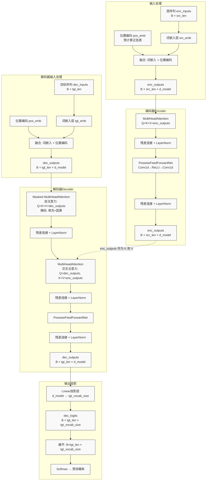

# Transformer 架构深度解析

## 1. 模型整体架构

本实现基于 Vaswani 等人提出的原始 Transformer 模型（"Attention Is All You Need", 2017），采用经典的编码器-解码器（Encoder-Decoder）架构，用于机器翻译任务（德语 → 英语）。

### 1.1 核心组件

| 组件 | 功能描述 | 关键操作 |
|------|----------|----------|
| **输入嵌入层** | 将离散 token 映射为连续向量 | `nn.Embedding(src_vocab_size, d_model)` |
| **位置编码层** | 注入序列位置信息（正弦/余弦编码） | `get_sinusoid_encoding_table()` |
| **编码器层** (×6) | 自注意力 + 前馈网络 | `EncoderLayer` |
| **解码器层** (×6) | 自注意力 + 交叉注意力 + 前馈网络 | `DecoderLayer` |
| **输出投影层** | 将隐藏状态映射为目标词汇表 logits | `nn.Linear(d_model, tgt_vocab_size)` |

### 1.2 数据流概览

```
源序列 → [词嵌入 + 位置编码] → [Encoder × 6层] → enc_outputs
                                              ↓
目标序列 → [词嵌入 + 位置编码] → [Decoder × 6层] ← enc_outputs (交叉注意力)
                                              ↓
                                    [线性投影] → logits → softmax → 预测词
```

---

## 2. 张量维度变化追踪

### 2.1 编码器阶段

| 步骤 | 张量名称 | 维度形状 | 说明 |
|------|----------|----------|------|
| 输入 | `enc_inputs` | `(B, src_len)` | B=batch_size, src_len=源序列长度 |
| 词嵌入 | `self.src_emb(enc_inputs)` | `(B, src_len, d_model)` | 每个 token 映射为 d_model 维向量 |
| 位置编码 | `self.pos_emb(...)` | `(1, src_len+1, d_model)` | 预计算的正弦位置编码表 |
| 嵌入融合 | `enc_outputs` | `(B, src_len, d_model)` | 词嵌入 + 位置编码 |
| 填充掩码 | `enc_self_attn_mask` | `(B, src_len, src_len)` | 标识 PAD 位置，用于注意力掩码 |
| 多头注意力 Q/K/V | `q_s, k_s, v_s` | `(B, n_heads, src_len, d_k)` | 线性投影后分割并转置 |
| 注意力分数 | `scores` | `(B, n_heads, src_len, src_len)` | Q·K^T / √d_k |
| 上下文向量 | `context` | `(B, n_heads, src_len, d_v)` | Softmax(attn)·V |
| 多头融合 | `context` (融合后) | `(B, src_len, n_heads×d_v)` | 转置并展平 |
| 输出投影 | `output` | `(B, src_len, d_model)` | 线性层: n_heads×d_v → d_model |
| 残差+层归一化 | `enc_outputs` | `(B, src_len, d_model)` | LayerNorm(output + residual) |
| 前馈网络中间 | `conv1 output` | `(B, d_ff, src_len)` | Conv1d: d_model → d_ff |
| 前馈网络输出 | `conv2 output` | `(B, d_model, src_len)` | Conv1d: d_ff → d_model |
| 编码器最终输出 | `enc_outputs` | `(B, src_len, d_model)` | 经过所有 EncoderLayer 后 |

### 2.2 解码器阶段

| 步骤 | 张量名称 | 维度形状 | 说明 |
|------|----------|----------|------|
| 输入 | `dec_inputs` | `(B, tgt_len)` | 目标序列（含起始符 S） |
| 词嵌入+位置编码 | `dec_outputs` | `(B, tgt_len, d_model)` | 同编码器 |
| 自注意力掩码 | `dec_self_attn_mask` | `(B, tgt_len, tgt_len)` | 填充掩码 + 因果掩码 |
| 交叉注意力掩码 | `dec_enc_attn_mask` | `(B, tgt_len, src_len)` | 解码器位置 × 编码器位置 |
| 解码自注意输出 | `dec_outputs` | `(B, tgt_len, d_model)` | Q=K=V=dec_outputs |
| 交叉注意输出 | `dec_outputs` | `(B, tgt_len, d_model)` | Q=dec_outputs, K=V=enc_outputs |
| 前馈网络输出 | `dec_outputs` | `(B, tgt_len, d_model)` | 同编码器结构 |
| 解码器最终输出 | `dec_outputs` | `(B, tgt_len, d_model)` | 经过所有 DecoderLayer 后 |

### 2.3 输出投影阶段

| 步骤 | 张量名称 | 维度形状 | 说明 |
|------|----------|----------|------|
| 解码器输出 | `dec_outputs` | `(B, tgt_len, d_model)` | 每个位置的隐藏表示 |
| 线性投影 | `dec_logits` | `(B, tgt_len, tgt_vocab_size)` | 映射到目标词汇空间 |
| 展平用于损失计算 | `dec_logits.view(-1, ...)` | `(B×tgt_len, tgt_vocab_size)` | 与标签对齐 |
| 标签展平 | `target_batch.view(-1)` | `(B×tgt_len,)` | 每个位置的目标 token 索引 |

---

## 3. Mermaid 数据流图



---

## 4. 关键设计选择与超参数

### 4.1 超参数配置

| 参数 | 值 | 含义 |
|------|------|------|
| `src_len` | 5 | 源序列最大长度（含 PAD） |
| `tgt_len` | 5 | 目标序列最大长度（含 S/E） |
| `d_model` | 512 | 词嵌入维度 / 隐藏状态维度 |
| `d_ff` | 2048 | 前馈网络中间层维度（4×d_model） |
| `d_k = d_v` | 64 | 每个注意力头的键/值维度 |
| `n_heads` | 8 | 多头注意力的头数 |
| `n_layers` | 6 | 编码器/解码器的堆叠层数 |
| `lr` | 0.001 | Adam 优化器学习率 |
| Epochs | 20 | 训练轮数 |

### 4.2 关键设计选择

#### (1) 缩放点积注意力 (Scaled Dot-Product Attention)
- **缩放因子**: `1/√d_k`，防止 d_k 较大时点积结果过大导致 softmax 梯度消失
- **计算公式**: `Attention(Q,K,V) = softmax(QK^T/√d_k)·V`

#### (2) 多头注意力 (Multi-Head Attention)
- **分割策略**: `d_model` → `n_heads × d_k` (512 → 8 × 64)
- **并行计算**: 通过 reshape + transpose 将 head 维度移到 batch 之后，实现批量化矩阵运算
- **拼接与投影**: 各头输出拼接后通过线性层映射回 `d_model`

#### (3) 位置编码 (Sinusoidal Positional Encoding)
- **正弦/余弦交替**: 偶数维使用 sin，奇数维使用 cos
- **公式**: `PE(pos, 2i) = sin(pos/10000^(2i/d_model))`, `PE(pos, 2i+1) = cos(pos/10000^(2i/d_model))`
- **冻结参数**: `freeze=True`，位置编码作为固定查找表，不参与梯度更新

#### (4) 残差连接与层归一化
- **结构**: `LayerNorm(x + Sublayer(x))`，每个子层后应用
- **作用**: 缓解梯度消失，加速训练收敛

#### (5) 注意力掩码设计
- **填充掩码 (Pad Mask)**: 将 PAD token 对应的注意力分数置为 `-1e9`，使其 softmax 后权重趋近于 0
- **因果掩码 (Subsequent Mask)**: 上三角矩阵，屏蔽未来位置的信息，确保解码器自回归生成时仅依赖已生成的 token

#### (6) 前馈网络 (Position-wise Feed-Forward Network)
- **实现方式**: 使用 `Conv1d(kernel_size=1)` 等价于在序列每个位置独立应用全连接层
- **结构**: `d_model → d_ff (ReLU) → d_model`

#### (7) 特殊符号约定
| 符号 | 含义 | 使用场景 |
|------|------|----------|
| S (Start) | 解码器输入起始符 | 目标序列开头，提示解码开始 |
| E (End) | 解码器输出结束符 | 目标序列末尾，标记翻译完成 |
| P (Pad) | 填充占位符 | 索引固定为 0，用于序列对齐 |

---

## 5. 训练流程

1. **数据准备**: `make_batch()` 将源序列、目标输入（含 S）、目标标签（含 E）转换为索引张量
2. **前向传播**: 
   - 编码器处理源序列得到上下文表示
   - 解码器处理目标输入并通过交叉注意力融合编码器输出
   - 投影层得到目标词汇表上的 logits
3. **损失计算**: `CrossEntropyLoss` 对展平后的 logits 和标签计算交叉熵
4. **反向传播**: `Adam` 优化器更新参数
5. **推理测试**: 直接输入目标序列验证预测准确性
