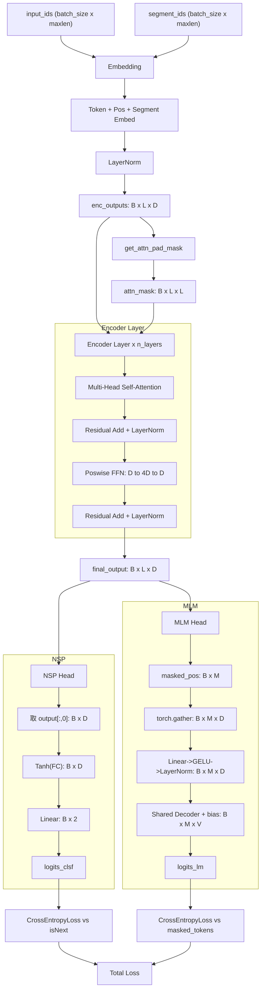

# BERT 模型技术文档

## 1. 模型整体架构

本实现基于 Google 提出的 **BERT-Base** 架构（Devlin et al., 2019），采用纯 Transformer Encoder 堆叠结构，用于两项预训练任务：
- **Masked Language Modeling (MLM)**：完形填空式掩码语言建模
- **Next Sentence Prediction (NSP)**：下一句预测分类任务

### 1.1 架构组成

```
┌─────────────────────────────────────────────────────────────────┐
│                        BERT 模型                                  │
├─────────────────────────────────────────────────────────────────┤
│  Input: input_ids, segment_ids, masked_pos                      │
│                           │                                      │
│                           ▼                                      │
│  ┌───────────────────────────────────────────────────────────┐  │
│  │                   Embedding Layer                          │  │
│  │  Token Embed + Position Embed + Segment Embed + LayerNorm │  │
│  └───────────────────────────────────────────────────────────┘  │
│                           │                                      │
│                           ▼                                      │
│  ┌───────────────────────────────────────────────────────────┐  │
│  │                 Encoder Layer × 6                          │  │
│  │  ┌─────────────────────────────────────────────────────┐  │  │
│  │  │              Multi-Head Attention                    │  │  │
│  │  │  (Q=K=V=enc_outputs, Pad Mask)                      │  │  │
│  │  └─────────────────────────────────────────────────────┘  │  │
│  │                           │                                │  │
│  │                           ▼                                │  │
│  │  ┌─────────────────────────────────────────────────────┐  │  │
│  │  │           Position-wise Feed-Forward Net             │  │  │
│  │  │           (Linear → GELU → Linear)                   │  │  │
│  │  └─────────────────────────────────────────────────────┘  │  │
│  └───────────────────────────────────────────────────────────┘  │
│                           │                                      │
│                           ▼                                      │
│          ┌────────────────┴────────────────┐                     │
│          ▼                                 ▼                     │
│  ┌───────────────────┐         ┌───────────────────────┐        │
│  │  NSP Head (分类)   │         │   MLM Head (语言建模)   │        │
│  │  CLS pooled → FC   │         │  Gather masked pos    │        │
│  │  → Tanh → Linear   │         │  → Linear → GELU      │        │
│  │  → 2-class logit   │         │  → LayerNorm          │        │
│  │                   │         │  → Shared Decoder     │        │
│  └───────────────────┘         └───────────────────────┘        │
└─────────────────────────────────────────────────────────────────┘
```

---

## 2. 张量维度追踪表

### 2.1 数据预处理阶段

| 步骤 | 变量名 | 维度 | 说明 |
|------|--------|------|------|
| 原始句子对 | `tokens_a`, `tokens_b` | `[len_a]`, `[len_b]` | 分词后的 token ID 列表 |
| 拼接输入 | `input_ids` | `[maxlen]` | `[CLS] + A + [SEP] + B + [SEP]`，不足补0 |
| 段落标识 | `segment_ids` | `[maxlen]` | 句子A为0，句子B为1，padding为0 |
| 掩码位置 | `masked_pos` | `[max_pred]` | 被掩盖的token位置索引，不足补0 |
| 掩码真实值 | `masked_tokens` | `[max_pred]` | 被掩盖的原始token ID，不足补0 |
| 批次张量 | `input_ids` (batch) | `[batch_size, maxlen]` | 拼批后的输入ID张量 |

### 2.2 Embedding 层

| 步骤 | 计算 | 维度 | 说明 |
|------|------|------|------|
| Token Embedding | `self.tok_embed(x)` | `[B, L, D]` | B=batch_size, L=maxlen, D=d_model |
| Position Embedding | `self.pos_embed(pos)` | `[B, L, D]` | 绝对位置编码，可学习 |
| Segment Embedding | `self.seg_embed(seg)` | `[B, L, D]` | 句子A/B标识嵌入 |
| 叠加 + LayerNorm | `norm(tok + pos + seg)` | `[B, L, D]` | 输出作为 Encoder 输入 |

### 2.3 Multi-Head Attention 层

| 步骤 | 计算 | 维度 | 说明 |
|------|------|------|------|
| 线性投影 Q | `self.W_Q(Q)` | `[B, L, D]` → `[B, L, H·d_k]` | H=n_heads, d_k=d_model/H |
| 重塑 + 转置 Q | `.view().transpose(1,2)` | `[B, H, L, d_k]` | 将 heads 移到第1维 |
| 线性投影 K | `self.W_K(K)` → 重塑转置 | `[B, H, L, d_k]` | 同 Q 的处理 |
| 线性投影 V | `self.W_V(V)` → 重塑转置 | `[B, H, L, d_v]` | d_v 通常等于 d_k |
| 注意力掩码 | `attn_mask.unsqueeze(1).repeat()` | `[B, H, L, L]` | 将 pad mask 广播到每个 head |
| QK^T 注意力分数 | `Q @ K^T / √d_k` | `[B, H, L, L]` | 缩放点积注意力分数 |
| Softmax 注意力权重 | `Softmax(scores)` | `[B, H, L, L]` | 沿最后一个维度归一化 |
| 加权求和 | `attn @ V` | `[B, H, L, d_v]` | 上下文向量 |
| 转置回原序 | `.transpose(1,2)` | `[B, L, H, d_v]` | 恢复序列维度在前 |
| 拼接 heads | `.contiguous().view()` | `[B, L, H·d_v]` | 多头输出拼接 |
| 输出投影 | `Linear(H·d_v, D)` | `[B, L, D]` | 映射回 d_model 维度 |
| 残差 + LayerNorm | `LayerNorm(output + residual)` | `[B, L, D]` | 残差连接 + 归一化 |

### 2.4 Position-wise Feed-Forward Network

| 步骤 | 计算 | 维度 | 说明 |
|------|------|------|------|
| 升维线性 | `fc1(x)` | `[B, L, D]` → `[B, L, d_ff]` | d_ff = 4 * d_model |
| GELU 激活 | `gelu()` | `[B, L, d_ff]` | 高斯误差线性单元 |
| 降维线性 | `fc2()` | `[B, L, d_ff]` → `[B, L, D]` | 恢复 d_model 维度 |

### 2.5 预训练任务输出头

| 任务 | 步骤 | 维度 | 说明 |
|------|------|------|------|
| **NSP** | 取 [CLS] 位置输出 | `output[:, 0]` → `[B, D]` | 首 token 表征整句 |
| NSP | `Tanh(FC(output[:, 0]))` | `[B, D]` |池化表示 |
| NSP | `classifier(h_pooled)` | `[B, 2]` | 二分类logits（IsNext / NotNext） |
| **MLM** | 扩展 masked_pos | `masked_pos[:, :, None].expand()` | `[B, M, D]`，M=max_pred |
| MLM | `torch.gather(output, 1, masked_pos)` | `[B, M, D]` |  gathers 被掩码位置的隐藏状态 |
| MLM | `Linear(D, D) → GELU → LayerNorm` | `[B, M, D]` | MLM 表示变换 |
| MLM | `decoder(h_masked) + bias` | `[B, M, V]` | V=vocab_size，词汇表logits |

---

## 3. Mermaid 数据流图



---

## 4. 关键设计选择与超参数

### 4.1 超参数配置

| 超参数 | 符号 | 本实现值 | 说明 |
|--------|------|----------|------|
| 最大序列长度 | `maxlen` | 30 | 含 [CLS], [SEP] 及 padding |
| 批次大小 | `batch_size` | 6 | 小批量训练 |
| 最大预测 token 数 | `max_pred` | 5 | MLM 任务最大掩码数 |
| Encoder 层数 | `n_layers` | 6 | BERT-Base 减半（原版12） |
| 注意力头数 | `n_heads` | 12 | 与 BERT-Base 一致 |
| 模型维度 | `d_model` | 768 | 嵌入维度，与 BERT-Base 一致 |
| FFN 隐藏维度 | `d_ff` | 3072 | 4 × d_model |
| Q/K/V 维度 | `d_k = d_v` | 64 | d_model / n_heads = 768/12 |
| 段落类型数 | `n_segments` | 2 | 句子A / 句子B |
| 掩码比例 | - | 15% | 符合原始 BERT 设计 |
| 掩码策略 | - | 80% [MASK], 10% 随机替换, 10% 不变 | 缓解预训练-微调差异 |

### 4.2 关键设计选择

1. **权重共享（Weight Tying）**
   - MLM 解码器权重与 Token Embedding 权重共享（`self.decoder.weight = embed_weight`）
   - 减少参数量，提高训练稳定性，参考 Word2Vec / Transformer-XL 实践

2. **[CLS] 池化策略**
   - 使用第一个 token（[CLS]）的最终隐藏状态作为句子级表征
   - 经过 `Linear → Tanh` 非线性变换后输入分类器
   - 注意：此为简单池化，现代实现多用 Mean Pooling 或额外 Pooler

3. **Padding Attention Mask**
   - `get_attn_pad_mask` 生成 `[B, L, L]` 布尔掩码，padding 位置（值为0）设为 `-1e9`
   - 使用 `unsqueeze(1)` + `expand` 实现高效广播，避免重复存储

4. **多头注意力维度拆分**
   - 单线性层投影后 `.view()` 拆分 heads，再通过 `.transpose(1,2)` 将 heads 提到前面
   - 相比为每个 head 创建独立 Linear 层，参数更少且计算更高效

5. **GELU 激活函数**
   - 采用原始 BERT 论文推荐的 GELU 而非 ReLU
   - 实现使用 `x * 0.5 * (1 + erf(x/√2))` 近似公式

6. **双任务联合训练**
   - MLM Loss + NSP Loss 直接相加，无额外权重系数
   - 两任务共用 Encoder 表征，梯度反向传播时自动平衡
